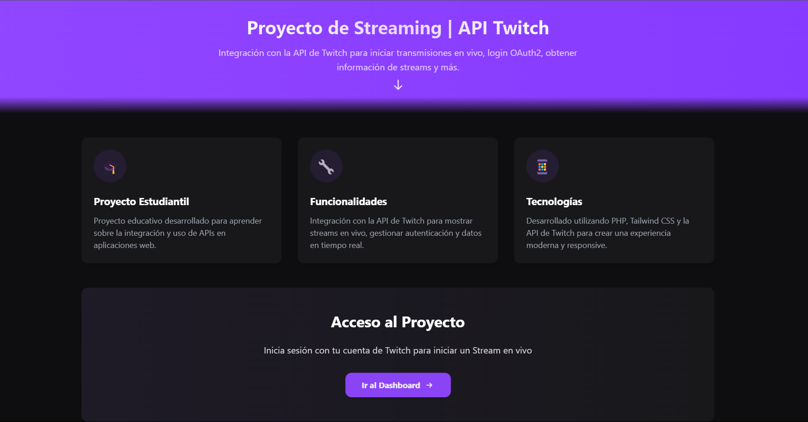

# 🎮 Proyecto de Streaming con Twitch API

Proyecto educativo que integra la API de Twitch para gestionar y mostrar transmisiones en vivo, desarrollado como parte del aprendizaje en integración de APIs y desarrollo web moderno.



## ✨ Características

- 🔐 Autenticación con Twitch
- 📺 Visualización de streams en vivo
- 📊 Dashboard con estadísticas en tiempo real
- 🎯 Integración completa con la API de Twitch
- 📱 Diseño responsive y moderno

## 🛠️ Tecnologías

<div align="center">


</div>
## 🚀 Instalación

1. **Prerequisitos**

- Tener instalado [XAMPP](https://www.apachefriends.org/es/index.html) (o cualquier servidor local de PHP)
- Tener instalado [Node.js](https://nodejs.org/)

2. **Clonar el repositorio**

```bash
# Clonar en la carpeta htdocs de XAMPP
cd C:/xampp/htdocs
git clone https://github.com/hk4u-dxv/API-Twitch-for-Streaming.git
cd API-Twitch-for-Streaming
```

3. **Instalar dependencias**

```bash
npm install
```

4. **Configurar variables de entorno**

```bash
cp .env.example .env
# Editar .env con tus credenciales de Twitch
```

5. **Compilar assets**

```bash
npm run dev
```

6. **Configurar servidor local**

- Iniciar XAMPP Control Panel
- Activar los módulos Apache y MySQL
- Acceder al proyecto en: `http://localhost/API-Twitch-for-Streaming`

## ⚙️ Configuración de Twitch

1. Crear una aplicación en [Twitch Developer Console](https://dev.twitch.tv/console)
2. Obtener Client ID y Client Secret
3. Configurar URL de redirección: `http://localhost/API-Twitch-for-Streaming/callback.php`
4. Agregar las credenciales en el archivo `.env`

## 📝 Variables de Entorno

```env
TWITCH_CLIENT_ID=tu_client_id_aquí
TWITCH_CLIENT_SECRET=tu_client_secret_aquí
TWITCH_REDIRECT_URI=http://localhost/tu_nombre_de_la_app/callback.php 
APP_DEBUG=true
APP_TIMEOUT=30
```

## 🔧 Estructura del Proyecto

```
API-Twitch-for-Streaming/
├── assets/
│   ├── css/          # Estilos compilados y animaciones
│   └── js/           # Scripts de JavaScript
├── config/           # Configuración de la aplicación
├── includes/         # Clases y funcionalidades principales
│   ├── TwitchAPI.php
│   ├── TwitchAuth.php
│   └── TwitchStreams.php
├── .env              # Variables de entorno
├── .env.example      # Ejemplo de variables de entorno
├── index.php         # Página principal
├── dashboard.php     # Panel de control
└── README.md
```

## 🥷 Autor

- GitHub: [@hk4u-dxv](https://github.com/hk4u-dxv)
